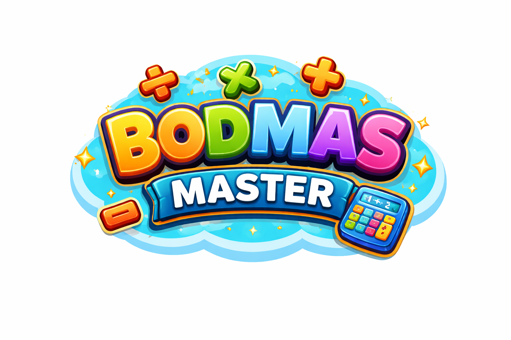

# BODMAS Master

An interactive math learning game to help students master the order of operations (BODMAS).



## 🎮 Live Demo

Play the game at: [https://arcode.netlify.app](https://arcode.netlify.app)

## 📚 What is BODMAS?

BODMAS tells us the correct order to solve math problems:

- **B** - Brackets (things inside parentheses)
- **O** - Orders (powers and square roots)
- **D** - Division
- **M** - Multiplication
- **A** - Addition
- **S** - Subtraction

## 🎯 How to Play

1. Click 3 tiles in order: a **NUMBER**, then a **SYMBOL** (+, −, ×, ÷), then another **NUMBER**
2. Follow the BODMAS rule - do × and ÷ before + and −
3. Correct answers earn points and merge tiles
4. Solve the entire expression to complete the level!

## ✨ Features

- Interactive tile-based gameplay
- BODMAS rule enforcement
- Step-by-step learning with hints
- Score and streak tracking
- Level progression
- Sound effects
- Responsive design
- Kid-friendly interface

## 🛠️ Tech Stack

- HTML5
- CSS3 (with animations)
- JavaScript (ES6+)
- PHP (for page serving)

## 🚀 Getting Started

### Option 1: PHP Built-in Server

```bash
php -S localhost:8000
```

Then open http://localhost:8000 in your browser.

### Option 2: XAMPP/LAMP

1. Copy the project folder to your web server's document root
2. Access via http://localhost/project-name/

### Option 3: Live Version

Visit https://arcode.netlify.app

## 📁 Project Structure

```
/project-root
├── index.php           # Main game page
├── README.md           # This file
├── /assets
│   ├── /css
│   │   └── styles.css  # Game styling
│   ├── /js
│   │   └── game.js     # Game logic
│   └── /images
│       └── logo.png    # Game logo
└── /components
    ├── header.php      # Site header
    └── footer.php      # Site footer
```

## 🎨 Screenshots

The game features:
- Modern, clean interface
- Colorful tile-based design
- Animated feedback
- Victory celebrations
- Responsive layout

## 🤝 Contributing

Contributions are welcome! Feel free to submit issues and pull requests.

## 📝 License

This project is open source and available for educational purposes.

## 👤 Developer

Developed and hosted by [Md Ashif Rahman](https://arcode.netlify.app)
